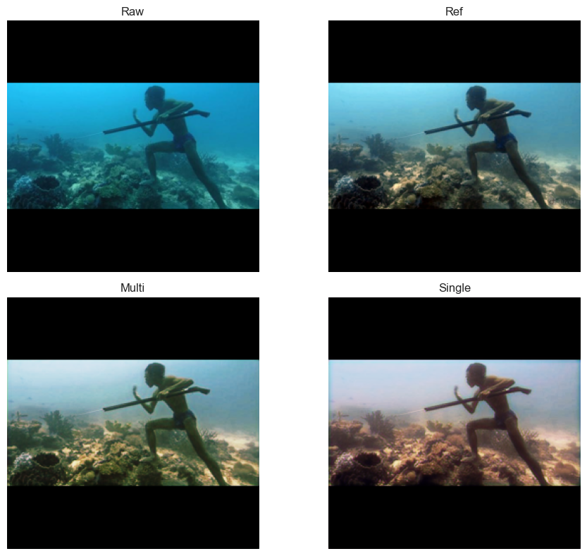
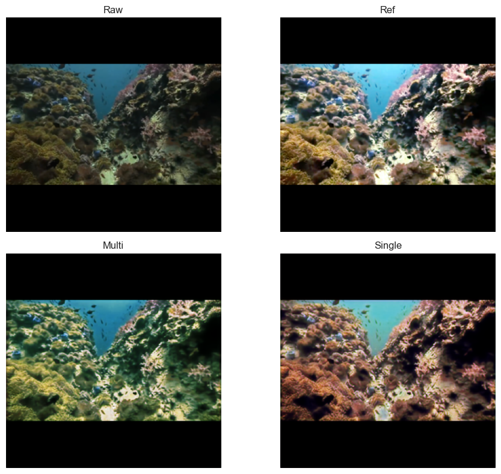

#  DIVE-GAN: Deep Image Visual Enhancements for Underwater Image Restoration

DIVE-GAN is a **GAN-based underwater image enhancement framework** that integrates **classical enhancement priors** (Gamma Correction, Histogram Equalization, and White Balance) within a **multi-branch CNN generator**.  
The generator refines these enhancements through learned confidence maps, while a **PatchGAN-style discriminator** ensures perceptual realism.  
This repository accompanies an **ongoing research paper**.

---

##  Overview

The proposed **DIVE-GAN (Deep Image Visual Enhancements)** model draws inspiration from **WaterNet (CVPR 2019)** and **FUnIE-GAN (IEEE RA-L 2020)**, improving upon both by fusing classical image priors with perceptual learning.

DIVE-GAN was evaluated on multiple underwater image datasets, including **UIEB**, **EUVP**, and additional real-world footage captured in chlorinated pool environments.  
The model achieves **higher SSIM and PSNR** compared to prior works while maintaining structural fidelity under domain shifts.

---

##  Key Features
- Hybrid **multi-branch generator** combining classical enhancement and deep learning.
- Patch-based **adversarial discriminator** for perceptual realism.
- Supports **single- and multi-layer perceptual losses** (VGG19-based).
- Complete **PyTorch** training and evaluation pipeline.
- Compatible with **UIEB** and **EUVP** datasets (and custom underwater data).
- Ready for reproducible experiments and ablation studies.

---

##  Directory Structure
```
DIVE-GAN/
│
├── dataset/
│   ├── RAW/                  # Raw underwater input images
│   └── REF/                  # Ground-truth / reference images
├── model_weight/
│   ├── gen/                  # Generator Weights
│   └── disc/                 # Discriminator Weights
│
├── train_pipeline.ipynb      # Training Pipeline
├── resizeandpad.py           # Helper to resize and pad input images 
├── Net.py                    # Model
├── loss_functions.py         # Loss functions
├── image_enhance.py          # Helpers to apply classical enhancements
├── gen_dataset.py            # Generate Dataset
├── DataUtils.py              # Data Loader and other utilites
│
└── requirements.txt          # Python dependencies

---
```

Make sure to create the datset and model_weight directories.

##  Setup and Installation

### 1. Clone and install dependencies
```bash
git clone https://github.com/Pranav070904/DIVE-GAN.git
cd DIVE-GAN
pip install -r requirements.txt
```

### 2. PyTorch
Install the right version of PyTorch from https://pytorch.org/get-started/locally

### 3. Dataset preparation

The datasets must be structured as follows:
```
datasets/
│
├── RAW/        # Input underwater images
│   ├── 0001.jpg
│   ├── 0002.jpg
│   └── ...
│
├── REF/        # Corresponding reference / ground-truth images
│   ├── 0001.jpg
│   ├── 0002.jpg
│   └── ...
```
---

Execute 
``` bash 
gen_dataset.py
```
With the correct directories.

##  Training and Evaluations

Run all code cells in order in 
```bash
train_pipeline.ipynb
```
The default configuration trains the model for **20 epochs** with **mixed-precision (AMP)** enabled.

---

##  Experimental Results

| Dataset          | Resolution | MSE ↓      | SSIM ↑     | PSNR (dB) ↑ |
| ---------------- | ---------- | ---------- | ---------- | ----------- |
| UIEB (trained)   | 256x256    | 0.008726   | 0.8866   | 20.70       |
| UIEB (trained)   | 112×112    | 0.0078     | 0.9041     | 21.20       |
| UIEB (retrained) | 128×128    | 0.0070     | **0.9294** | 21.73       |
| EUVP             | 256×256    | **0.0036** | 0.8653     | **24.53**   |

---

##  Qualitative Results

DIVE-GAN effectively restores perceptual structure and color tone while suppressing underwater haze artifacts.
The images results on UIEB datasets(256x256 pixels) and also the result comparison between the Single-Layer Perceptual Loss and Multi-Layer Perceptual Loss configurations.




---

##  Related Work

This repository builds upon ideas from the following works:

* **WaterNet** – *Attention-based CNN for Underwater Image Enhancement* (CVPR 2019)
  [https://li-chongyi.github.io/proj_benchmark.html]
* **FUnIE-GAN** – *Fast Underwater Image Enhancement for Improved Visual Perception* (IEEE RA-L 2020)
  [https://github.com/xahidbuffon/FUnIE-GAN](https://github.com/xahidbuffon/FUnIE-GAN) (MIT License)
* **UIEB Dataset** – Underwater Image Enhancement Benchmark Dataset
* **EUVP Dataset** – Enhancing Underwater Visual Perception Dataset

---

##  License

This repository is released under the **MIT License**.
See [LICENSE](LICENSE) for details.

Parts of this implementation draw conceptual inspiration from **WaterNet** and **FUnIE-GAN**, whose works are acknowledged above.

---

###  Acknowledgements

This work integrates classical enhancement priors with modern adversarial learning to enhance underwater vision.
It was developed as part of an **undergraduate research project** exploring robust perception models for underwater robotics and imaging.